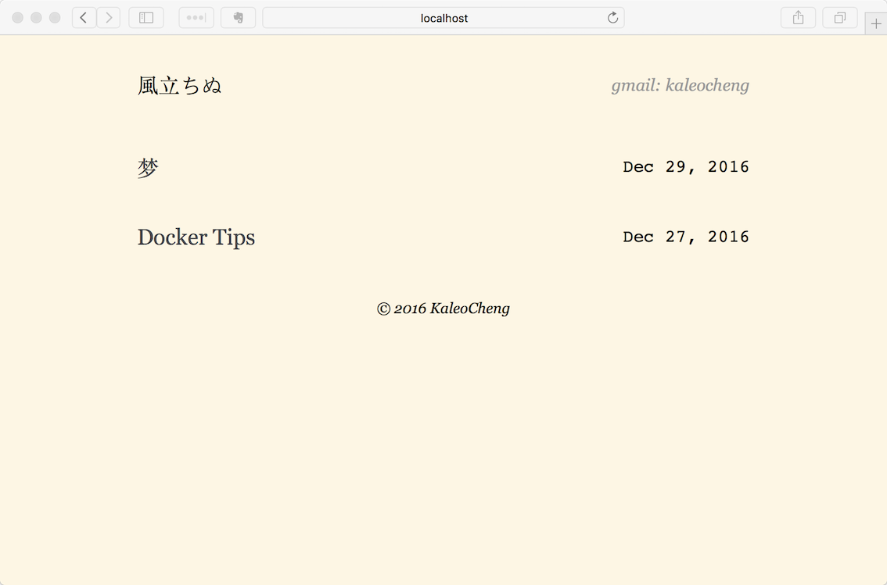

**More and more customized stuff in this theme, moved it to a private repo.**

# Chopin

A sample theme for  [Hugo](http://gohugo.io).


# Table of Contents

* [Getting Started](#getting-started)
* [Screenshots](#screenshots)
* [Changelog](#changelog)
* [License](#license)

## Getting Started 

````
git clone https://github.com/kaleocheng/chopin.git themes/chopin
````

generate your site's files:

````shell
hugo --theme="chopin"
````

## Screenshots




## License

Licensed under the MIT License. See the [LICENSE](https://github.com/fuegowolf/cocoa-eh-hugo-theme/blob/master/LICENSE.md) file for more details.
